# proyecto-sagemaker-spark

> **Motor de recomendación de SKUs para rutas de venta de AJE**, desplegado sobre **AWS SageMaker Pipelines + PySpark ALS**, multi-país (LATAM).

---

## ¿Qué hace este repo?

Este repositorio contiene el sistema **Pedido Sugerido (PS)** de AJE: un pipeline de MLOps que, **cada día**, le dice al vendedor de cada ruta **qué SKUs debería ofrecerle a cada cliente** en su próxima visita, basándose en el historial de compras de clientes similares.

El sistema funciona en **8 países** de LATAM en paralelo, con pipelines estructuralmente idénticos pero ajustes de negocio por país. Al final del día, un módulo de **Reporting** consolida los pedidos de todos los países, calcula métricas, envía un email HTML de resumen y sube un archivo central de pedidos a S3 para ser consumido por Salesforce.

```
           ┌────────────────────────────────────────────────┐
           │         ENTRADA (por país, diaria)             │
           │  • Maestro de productos (Redshift)             │
           │  • Visitas de vendedores (S3, parquet)         │
           │  • Ventas históricas (S3, parquet)             │
           │  • Stock actual (S3)                           │
           │  • Lista de precios (Excel)                    │
           └───────────────────────┬────────────────────────┘
                                   ▼
       ┌───────────────────────────────────────────────────┐
       │  PIPELINE SAGEMAKER (3 pasos, encadenados)        │
       │                                                    │
       │  1. LIMPIEZA     → sklearn ScriptProcessor        │
       │  2. MODELADO     → PySpark ALS (implicit)         │
       │  3. REGLAS NEG.  → sklearn ScriptProcessor        │
       └───────────────────────┬───────────────────────────┘
                                   ▼
       ┌───────────────────────────────────────────────────┐
       │  SALIDA: D_base_pedidos_YYYY-MM-DD.csv            │
       │  (por país → S3 backup)                            │
       └───────────────────────┬───────────────────────────┘
                                   ▼
       ┌───────────────────────────────────────────────────┐
       │  REPORTING (consolida los 8 países)                │
       │  • Email HTML con métricas                         │
       │  • Archivo central → Salesforce                    │
       └───────────────────────────────────────────────────┘
```

---

## Países soportados

| Código | País | Módulos | Notas |
|---|---|---|---|
| `PS_Peru` | Perú | PS | ~500 rutas, mercado más grande. Lógica especial para Lima Centro. |
| `PS_Mexico` | México | PS + `deploy/` | **Único con pipeline de despliegue productivo** (`ps_1` … `ps_9`). Pilot con 4 rutas. |
| `PS_Ecuador` | Ecuador | PS | Estándar. |
| `PS_Econoredes_Ecuador` | Ecuador (canal Econoredes) | PS | Variante del canal Econoredes. |
| `PEs_Ecuador` | Ecuador | **PE** (estratégico) | Lista fija de productos × clientes, no usa ML. |
| `PS_Guatemala` | Guatemala | PS | Estándar. |
| `PS_Nicaragua` | Nicaragua | PS | Estándar. |
| `PS_Panama` | Panamá | PS | Estándar. |
| `PS_CostaRica` | Costa Rica | PS | Estándar. |

Siglas:
- **PS** = *Pedido Sugerido* (recomendación ML basada en ALS).
- **PE** = *Plan Estratégico* (reglas fijas, sin ML).
- **PR** = *Pedido Recurrente* (módulo legacy de Ecuador, consumido por Reporting).

---

## Estructura del repositorio

```
proyecto-sagemaker-spark/
├── README.md                      ← este archivo
├── docs/                          ← documentación detallada
│   ├── arquitectura.md            ← AWS, buckets, Redshift, SageMaker
│   ├── pipeline.md                ← los 3 pasos explicados a fondo
│   ├── modelo-als.md              ← el modelo ALS implícito (PySpark MLlib)
│   ├── reglas-negocio.md          ← las 9+ reglas, en orden
│   ├── paises.md                  ← diferencias entre países
│   ├── deploy-mexico.md           ← pipeline de producción de México
│   ├── reporting.md               ← módulo de consolidación + email
│   └── datos.md                   ← inputs, outputs, paths S3
│
├── PS_Peru/                       ← Pipeline Perú
├── PS_Mexico/                     ← Pipeline México (+ deploy/)
├── PS_Ecuador/
├── PS_Econoredes_Ecuador/
├── PEs_Ecuador/                   ← Plan Estratégico (no ML)
├── PS_Guatemala/
├── PS_Nicaragua/
├── PS_Panama/
├── PS_CostaRica/
└── Reporting/                     ← Consolidación de todos los países
```

### Estructura interna de cada carpeta de país

```
PS_<Pais>/
├── PROD_PS_<Pais>.ipynb              ← Notebook todo-en-uno (referencia)
├── TEST_PS_XX_1_limpieza.py          ← Paso 1: limpieza de datos
├── TEST_PS_XX_2_modelado.py          ← Paso 2: entrenamiento ALS
├── TEST_PS_XX_3_reglas_negocio.py    ← Paso 3: filtros de negocio
├── TEST_PS_XX_4_orquestador_pipeline.ipynb   ← Lanza el Pipeline SageMaker
├── Input/                            ← Datos crudos descargados
├── Processed/                        ← Datos limpios intermedios
└── Output/                           ← Recomendaciones finales
```

Los prefijos:
- `PROD_` — notebook todo-en-uno usado como **fuente de verdad** / referencia histórica.
- `TEST_` — scripts modulares y notebooks que **sí se ejecutan en producción** vía SageMaker Pipelines (el nombre `TEST_` es engañoso por razones históricas).

---

## Arquitectura en una imagen

```mermaid
flowchart LR
    subgraph S3_IN["AWS S3 · Buckets de entrada"]
        A1[maestro_productos]
        A2[visitas.parquet]
        A3[ventas.parquet]
        A4[stock]
        A5[lista_precios.xlsx]
    end

    subgraph SM["AWS SageMaker Pipelines"]
        B1["Paso 1 · Limpieza<br/>ScriptProcessor<br/>ml.m5.4xlarge"]
        B2["Paso 2 · Modelado<br/>PySparkProcessor<br/>ALS implicit"]
        B3["Paso 3 · Reglas<br/>ScriptProcessor<br/>9+ filtros"]
        B1 --> B2 --> B3
    end

    subgraph S3_OUT["AWS S3 · Buckets de salida"]
        C1["D_base_pedidos_YYYY-MM-DD.csv<br/>(por país)"]
    end

    subgraph RPT["Reporting"]
        D1["Concatenar 8 países"]
        D2["Métricas + Email HTML"]
        D3["Subir a bucket central"]
    end

    subgraph SF["Salesforce"]
        E1["base_pedidos.csv"]
    end

    S3_IN --> SM
    B3 --> C1
    C1 --> D1 --> D2
    D1 --> D3 --> E1
```



**Más detalle:** [docs/arquitectura.md](docs/arquitectura.md)

---

## El pipeline en 3 pasos (resumen)

| # | Paso | Tipo de job | Qué hace | Entrada | Salida |
|---|---|---|---|---|---|
| 1 | **Limpieza** | `ScriptProcessor` (sklearn) | Une visitas + ventas, normaliza `id_cliente`, deduplica, filtra por compañía y fecha. | parquet crudo | parquet/csv limpio |
| 2 | **Modelado** | `PySparkProcessor` (Spark 3.3) | Entrena **ALS implícito** sobre la matriz cliente × SKU (frecuencia como señal). Genera top-N recomendaciones por cliente. | salida del paso 1 | ranking `r1, r2, r3…` por cliente |
| 3 | **Reglas de negocio** | `ScriptProcessor` (sklearn) | Aplica 9+ filtros comerciales: ventas recientes, stock, precios, dedup histórica, despriorización de SKUs ya comprados. | salidas de pasos 1 y 2 | `D_base_pedidos_YYYY-MM-DD.csv` |

**Más detalle:** [docs/pipeline.md](docs/pipeline.md) · [docs/modelo-als.md](docs/modelo-als.md) · [docs/reglas-negocio.md](docs/reglas-negocio.md)

---

## Quickstart — ¿cómo lo corro?

### A) Ejecutar el pipeline completo en SageMaker (producción)

Abre el notebook orquestador del país que quieras correr:

```
PS_Peru/TEST_PS_PE_4_orquestador_pipeline.ipynb
```

Y ejecuta todas las celdas. El notebook:

1. Sube los 3 scripts (`_1_limpieza.py`, `_2_modelado.py`, `_3_reglas_negocio.py`) a S3.
2. Crea/actualiza el Pipeline en SageMaker (`pipeline.upsert(...)`).
3. Lanza la ejecución (`pipeline.start().wait()`).
4. Al terminar, deja el CSV en el bucket `aje-analytics-ps-backup`.

### B) Ejecutar México en modo producción local (deploy/)

México tiene un pipeline paralelo listo para correr **fuera** de SageMaker, útil para debugging o jobs ad-hoc:

```bash
cd PS_Mexico/deploy
python ps_9_run_all.py        # ejecuta ps_1 → ps_2 → ps_3 → ps_4 → ps_5
```

Pasos individuales:

| Script | Qué hace |
|---|---|
| `ps_1_dwld_input.py` | Valida frescura + descarga inputs (Redshift + S3). |
| `ps_2_process_input.py` | Limpia y une datos (equivalente al Paso 1 de SageMaker). |
| `ps_3_run_model.py` | Entrena ALS y genera recomendaciones (Paso 2). |
| `ps_4_reglas_negocio.py` | Aplica reglas de negocio (Paso 3). |
| `ps_5_subir_a_SF.py` | Formatea para Salesforce y sube a S3. |
| `ps_9_run_all.py` | Orquestador: corre todos en orden. |

**Más detalle:** [docs/deploy-mexico.md](docs/deploy-mexico.md)

### C) Ejecutar el reporte consolidado de todos los países

```
Reporting/TEST_RPT_2_orquestador_pipeline.ipynb
```

Internamente ejecuta `TEST_RPT_1_reporte_todos_paises.py`, que:

1. Carga las salidas de los 8 países desde S3.
2. Calcula métricas (clientes, SKUs, marcas).
3. Arma un email HTML y lo envía.
4. Sube un CSV central a `s3://aje-prd-pedido-sugerido-orders-s3/PE/pedidos/base_pedidos.csv`.

**Más detalle:** [docs/reporting.md](docs/reporting.md)

---

## El modelo ML — ALS implícito (PySpark MLlib)

El núcleo recomendador es **Alternating Least Squares (ALS) con preferencias implícitas**. La "señal" no es un rating explícito, sino la **frecuencia de compra** de un SKU por un cliente (contar fechas de liquidación distintas).

```python
ALS(
    rank=10,                  # factores latentes
    maxIter=5,
    implicitPrefs=True,
    ratingCol="rating",       # = frecuencia de compra
    itemCol="cod_articulo_magic",
    userCol="clienteId_numeric",
    coldStartStrategy="drop"
)
```

Tras entrenar, se llama a `recommendForAllUsers(N)` y se post-procesan los resultados a un ranking `r1, r2, r3, …` por cliente.

**Más detalle:** [docs/modelo-als.md](docs/modelo-als.md)

---

## Reglas de negocio — por qué no se recomienda todo lo que el modelo dice

El Paso 3 aplica **filtros duros** y **despriorizaciones** sobre el ranking del modelo:

| Regla | Efecto |
|---|---|
| **5.-9** Disponibilidad | Solo SKUs con ventas en la ruta en los últimos 14 días. |
| **5.-8** Tendencia S/M/B | Marca SKU como Subida / Mantiene / Baja y reordena. |
| **5.-7** Maestro | Valida que el SKU exista en el maestro de productos vigente. |
| **5.-5** Stock | Excluye si stock < 3 × promedio diario de unidades vendidas. |
| **5.-4** Lista Excel | (Opcional) excluye SKUs marcados por negocio en Excel. |
| **5.-3** Sin precio | Excluye SKUs hardcodeados sin precio vigente. |
| **5.-2** Dedup histórica | Excluye SKUs ya recomendados a ese cliente en los últimos 14 días. |
| **5.3** Ya comprados | **Despriorización** de SKUs comprados en las últimas 2 semanas (cambio reciente: antes se eliminaban; ahora solo bajan en ranking). |

**Más detalle:** [docs/reglas-negocio.md](docs/reglas-negocio.md)

---

## Stack técnico

| Capa | Tecnologías |
|---|---|
| **Orquestación** | AWS SageMaker Pipelines (Python SDK) |
| **Compute** | SageMaker Processing Jobs (`ml.m5.4xlarge`) |
| **ML** | PySpark 3.3 MLlib — ALS implícito |
| **Procesamiento** | pandas, numpy, pyarrow |
| **Data** | AWS S3 (parquet, csv), Redshift (`awswrangler`, `redshift-connector`) |
| **Excel/Master** | openpyxl |
| **Notifs** | smtplib (email HTML) |
| **Región** | `us-east-2` |

Dependencias congeladas: [PS_Mexico/deploy/requirements.txt](PS_Mexico/deploy/requirements.txt)

---

## Documentación completa (docs/)

| Archivo | Contenido |
|---|---|
| [docs/arquitectura.md](docs/arquitectura.md) | AWS infra: buckets S3, Redshift, SageMaker, diagrama de flujo completo. |
| [docs/pipeline.md](docs/pipeline.md) | Los 3 pasos del pipeline explicados paso a paso. |
| [docs/modelo-als.md](docs/modelo-als.md) | El modelo ALS: qué es, por qué implícito, cómo se entrena, parámetros. |
| [docs/reglas-negocio.md](docs/reglas-negocio.md) | Las 9+ reglas de negocio, orden, lógica y ejemplos. |
| [docs/paises.md](docs/paises.md) | Tabla comparativa de países: rutas, compañías, SKUs excluidos, parámetros. |
| [docs/deploy-mexico.md](docs/deploy-mexico.md) | Pipeline productivo local de México: `ps_1` a `ps_9` explicado. |
| [docs/reporting.md](docs/reporting.md) | Cómo se consolidan los 8 países, las métricas, el email y la subida final. |
| [docs/datos.md](docs/datos.md) | Catálogo de inputs, outputs, paths S3, tablas Redshift. |

---

## Convenciones y notas

- Los notebooks `PROD_*.ipynb` son **referencias históricas / exploración**. Los que se ejecutan en producción son los notebooks orquestadores `TEST_*_4_orquestador_pipeline.ipynb` (el prefijo `TEST_` es engañoso por razones históricas).
- Los identificadores de cliente se construyen como `<PAIS>|<COMPANIA>|<CLIENTE>` (ej. `MX|30|123456`).
- El archivo final de pedidos siempre se llama `D_base_pedidos_YYYY-MM-DD.csv`.
- La ejecución es **diaria** y la fecha se toma de la columna `fecha_proceso` del archivo de visitas.
