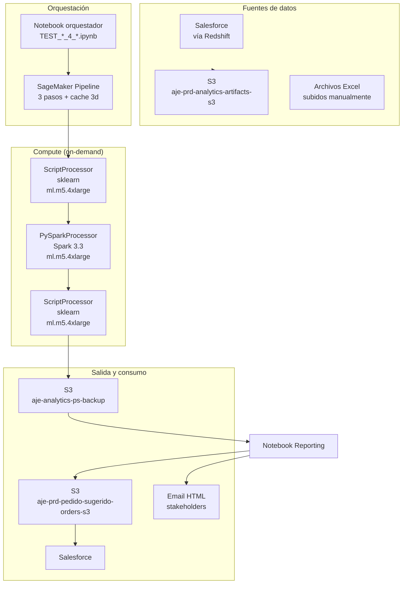

# Arquitectura

> Cómo está montado el sistema en AWS: buckets, Redshift, SageMaker, red de flujos.

---

## Vista general

El sistema vive **100% en AWS** (región `us-east-2`). No hay servidores ni clústeres siempre encendidos: todo se ejecuta bajo demanda como **Processing Jobs** de SageMaker, lanzados desde un notebook orquestador.



---

## Componentes AWS

### 1. Amazon S3 — 3 buckets principales

| Bucket | Uso | Estructura típica |
|---|---|---|
| `aje-prd-analytics-artifacts-s3` | **Entrada**: datos crudos diarios por país. | `pedido_sugerido/data-v1/<pais>/visitas_<pais>000.parquet`, `.../ventas_<pais>000.parquet`, `.../maestro_productos_<pais>000.csv`, `.../stock/...` |
| `aje-analytics-ps-backup` | **Backup por país**: cada país deja aquí su CSV diario. Insumo del Reporting. | `PS_<Pais>/Output/PS_piloto_v1/D_base_pedidos_YYYY-MM-DD.csv` |
| `aje-prd-pedido-sugerido-orders-s3` | **Salida central**: un único archivo consolidado que Salesforce consume. | `PE/pedidos/base_pedidos.csv` |

### 2. Amazon Redshift

- Cluster: `dwh-cloud-storage-salesforce-prod`
- Database: `dwh_prod`
- Conexión vía `awswrangler[redshift]` + `redshift-connector`
- **Tablas clave** usadas por el pipeline:
  - `comercial_<pais>.dim_producto` — maestro de productos vigente.
  - (otras por país, ver [datos.md](datos.md))

### 3. AWS SageMaker

Dos servicios principales:

**SageMaker Studio / Notebook Instance** — donde viven y se ejecutan los notebooks orquestadores (`TEST_*_4_orquestador_pipeline.ipynb`). El rol IAM del notebook es el que el Pipeline asume para crear recursos.

**SageMaker Pipelines** — API Python que:

1. Sube los scripts `.py` al bucket de trabajo.
2. Crea/actualiza un Pipeline con sus 3 steps.
3. Ejecuta (`pipeline.start()`) y espera (`wait()`).
4. Cachea resultados por 3 días (`CacheConfig(expire_after="P3D")`) para poder reintentar steps sin rehacer todo.

Cada step corre en una **instancia efímera** `ml.m5.4xlarge` (16 vCPU, 64 GB RAM), que se levanta, ejecuta y muere.

---

## Flujo de datos detallado

```
┌──────────────────────────────────────────────────────────────────────┐
│ 00:00 — ETL upstream (fuera de este repo)                             │
│   Salesforce → Redshift → S3 (aje-prd-analytics-artifacts-s3)        │
│   Deja: visitas_<pais>000.parquet, ventas_<pais>000.parquet          │
└────────────────────────────────┬─────────────────────────────────────┘
                                  ▼
┌──────────────────────────────────────────────────────────────────────┐
│ 07:00 — Notebook orquestador (por país)                               │
│   • Valida que el input sea del día (fecha de modificación = hoy).   │
│   • Descarga maestro de productos de Redshift → S3 del notebook.     │
│   • Sube los 3 scripts .py al S3 de la pipeline.                     │
│   • pipeline.upsert(role_arn).start().wait()                          │
└────────────────────────────────┬─────────────────────────────────────┘
                                  ▼
┌──────────────────────────────────────────────────────────────────────┐
│ Paso 1 · LIMPIEZA (~5-10 min)                                         │
│   Input:  /opt/ml/processing/input/{visitas,ventas,maestro}          │
│   Output: /opt/ml/processing/output/limpieza/data_limpia.parquet     │
└────────────────────────────────┬─────────────────────────────────────┘
                                  ▼
┌──────────────────────────────────────────────────────────────────────┐
│ Paso 2 · MODELADO · PySpark ALS (~10-20 min)                          │
│   Input:  /opt/ml/processing/input/limpieza/                          │
│   Output: /opt/ml/processing/output/modelado/recomendaciones.parquet  │
└────────────────────────────────┬─────────────────────────────────────┘
                                  ▼
┌──────────────────────────────────────────────────────────────────────┐
│ Paso 3 · REGLAS DE NEGOCIO (~3-5 min)                                 │
│   Input:  outputs de pasos 1 y 2                                      │
│   Output: D_base_pedidos_YYYY-MM-DD.csv                               │
│   → Sube a s3://aje-analytics-ps-backup/PS_<Pais>/Output/              │
└────────────────────────────────┬─────────────────────────────────────┘
                                  ▼
┌──────────────────────────────────────────────────────────────────────┐
│ 10:00 — Reporting consolidado (notebook orquestador)                  │
│   • Lee los 8 CSVs del bucket de backup.                              │
│   • Concatena en un solo DataFrame.                                   │
│   • Calcula 3 tablas de métricas.                                     │
│   • Envía email HTML (smtplib, Gmail SMTP).                           │
│   • Sube base_pedidos.csv al bucket central → Salesforce.             │
└──────────────────────────────────────────────────────────────────────┘
```

---

## Identificadores clave

El pipeline normaliza **todo** cliente con la clave:

```
<PAIS>|<COMPANIA>|<CLIENTE>
```

Ejemplos:
- `PE|10|12345` — cliente 12345 de la compañía 10 en Perú.
- `MX|30|98765` — cliente 98765 de la compañía 30 en México.

Esto importa porque:
- `ALS` necesita un `userId` numérico único → se mapea con `StringIndexer` y se guarda el mapeo.
- El join entre visitas y ventas se hace sobre esta clave compuesta (evita colisiones entre compañías).

---

## Caching y reejecución

El Pipeline tiene caché habilitado:

```python
cache_config = CacheConfig(
    enable_caching=True,
    expire_after="P3D"  # 3 días
)
```

**Implicación práctica:** si un step falla, al relanzar el Pipeline los steps anteriores **no se reejecutan** si sus inputs no cambiaron. Muy útil para recuperarse de fallos en el paso 3 sin volver a entrenar el ALS.

**Cuidado:** si cambias un script pero los inputs S3 son los mismos, el caché puede darte una salida vieja. Para forzar reentrenamiento, invalida el caché o cambia el nombre del step.

---

## IAM y permisos

El notebook orquestador asume un role de SageMaker (via `sagemaker.get_execution_role()`) que debe tener:

- `s3:GetObject`, `s3:PutObject`, `s3:ListBucket` sobre los 3 buckets.
- `redshift-data:*` para leer el maestro.
- `sagemaker:CreatePipeline`, `sagemaker:StartPipelineExecution`, etc.
- Permiso de pasar el role a los jobs de processing.

---

## Diagnóstico y logs

- **Logs de cada step**: CloudWatch Logs, log group `/aws/sagemaker/ProcessingJobs`.
- **Estado del Pipeline**: SageMaker Studio → Pipelines → `<nombre_pipeline>` → ver grafo + logs.
- **Artefactos intermedios**: cada step escribe a `/opt/ml/processing/output/<nombre>` que se sincroniza a S3 automáticamente. Puedes descargar los parquets intermedios para debuggear.
