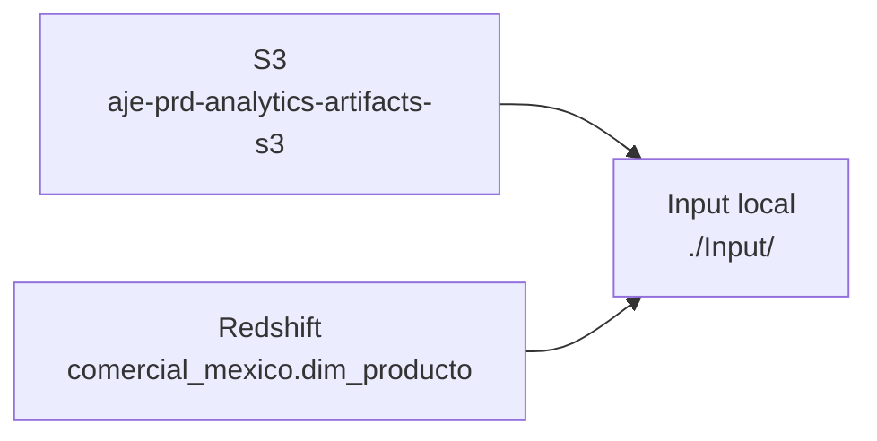

# Deploy México — pipeline productivo local

> Los scripts `ps_1` a `ps_9` en `PS_Mexico/deploy/`. Pipeline que corre **fuera** de SageMaker, localmente o en una EC2.

---

## Por qué existe

El notebook orquestador de SageMaker (`TEST_PS_MX_4_orquestador_pipeline.ipynb`) es cómodo para desarrollo, pero tiene fricción en producción:

- Overhead de arranque de jobs (~3-5 min por step × 3 steps).
- Coste de instancias `ml.m5.4xlarge` bajo demanda.
- Dependencia del caché de Pipelines, que puede dar sorpresas.
- Difícil de integrar con cron o con un orquestador externo (Airflow, Step Functions).

La carpeta `deploy/` es una **ejecución lineal** del mismo pipeline, empaquetada como 5 scripts que se corren en orden con un solo comando.

---

## Los scripts

```
PS_Mexico/deploy/
├── ps_1_dwld_input.py      ← 1. Descarga de inputs
├── ps_2_process_input.py   ← 2. Limpieza
├── ps_3_run_model.py       ← 3. Modelo ALS
├── ps_4_reglas_negocio.py  ← 4. Reglas de negocio
├── ps_5_subir_a_SF.py      ← 5. Formato + upload Salesforce
├── ps_9_run_all.py         ← Orquestador (corre 1 a 5)
└── requirements.txt        ← Dependencias congeladas
```

Uso directo:

```bash
cd PS_Mexico/deploy
pip install -r requirements.txt
python ps_9_run_all.py
```

---

## Paso a paso

### `ps_1_dwld_input.py` · Descarga de inputs



1. **Valida frescura** de los inputs en S3:
   - `visitas_mexico000.parquet` — fecha de modificación debe ser hoy.
   - `ventas_mexico000.parquet` — idem.
   - Si no, aborta (no tiene sentido procesar data vieja).
2. **Descarga** a `./Input/`:
   - `visitas_mexico000.parquet`
   - `ventas_mexico000.parquet`
   - Stock actual (vía S3)
3. **Consulta Redshift** y descarga el maestro vigente:
   ```python
   wr.redshift.read_sql_query(
       "SELECT * FROM comercial_mexico.dim_producto",
       con=con
   ).to_csv("Input/MX_maestro_productos.csv")
   ```
4. Cualquier Excel manual (`LISTA DE PRECIOS MEXICO_*.xlsx`, `MX_SKUS.xlsx`) debe ya estar en `Input/` — no se descarga, lo sube negocio.

**Output:** todo en `Input/`.

---

### `ps_2_process_input.py` · Limpieza

Equivalente al Paso 1 del pipeline SageMaker.

1. Lee `Input/visitas_mexico000.parquet` y `Input/ventas_mexico000.parquet`.
2. Construye `id_cliente = "MX|<compania>|<cliente>"`.
3. Extrae `cod_articulo_magic` de `id_producto`.
4. Filtra por `fecha_proceso = hoy`.
5. Deduplica visitas (última por `ultima_visita`).
6. Une visitas + ventas.
7. Guarda en `Processed/`:
   - `mexico_ventas_manana.parquet` — los clientes a recomendar (los que tienen visita hoy).
   - `ventas_mexico_12m.parquet` — historial 12 meses para el modelo.
   - `rutas/` — splits por ruta para debugging.

**Output:** archivos en `Processed/`.

---

### `ps_3_run_model.py` · Modelo ALS

Equivalente al Paso 2 del pipeline SageMaker.

1. Lee `Processed/ventas_mexico_12m.parquet`.
2. Arranca SparkSession local:
   ```python
   spark = SparkSession.builder \
       .appName("PS_Mexico_ALS") \
       .config("spark.driver.memory", "8g") \
       .getOrCreate()
   ```
3. Construye matriz `(id_cliente, cod_articulo_magic, rating=count_distinct_fechas)`.
4. `StringIndexer` sobre `id_cliente`.
5. Entrena `ALS(rank=10, maxIter=5, implicitPrefs=True)`.
6. Genera top-20 recomendaciones con `model.recommendForAllUsers(20)`.
7. Des-pivota y guarda en `Output/PS_piloto_data_v1/`.

**Output:** parquet de recomendaciones por cliente.

**Nota:** tiene código legacy comentado de KMeans. Ignorar.

---

### `ps_4_reglas_negocio.py` · Reglas de negocio

Equivalente al Paso 3 del pipeline SageMaker.

Aplica las 9+ reglas descritas en [reglas-negocio.md](reglas-negocio.md):

1. 5.-9 · Disponibilidad (14d).
2. 5.-8 · Clasificación S/M/B.
3. 5.-7 · Maestro de productos.
4. 5.-5 · Stock (>3× promedio).
5. 5.-4 · Excel (opcional).
6. 5.-3 · SKUs sin precio (hardcoded).
7. 5.-2 · Dedup histórica (14d).
8. 5.3 · Despriorización de ya comprados.

Además calcula `tipoRecomendacion`, `marca`, `irregularidad`, etc.

**Output:** `Output/PS_piloto_v1/D_base_pedidos_YYYY-MM-DD.csv`.

---

### `ps_5_subir_a_SF.py` · Formato + upload Salesforce

1. Lee `Output/PS_piloto_v1/D_base_pedidos_YYYY-MM-DD.csv`.
2. Normaliza columnas al esquema que espera Salesforce:
   ```
   Pais, Compania, Sucursal, Cliente, Modulo, Producto, Cajas, Unidades, Fecha
   ```
3. Cuenta ordenamientos por marca para monitoring.
4. Sube a `s3://aje-analytics-ps-backup/PS_Mexico/Output/PS_piloto_v1/D_base_pedidos_YYYY-MM-DD.csv`.
5. (El Reporting, después, lo lee desde ahí y lo consolida con los demás países).

**Output S3 final:** bucket backup; el Reporting se encarga del archivo central.

---

### `ps_9_run_all.py` · Orquestador

Script simple: `subprocess.run()` sobre `ps_1`, `ps_2`, `ps_3`, `ps_4`, `ps_5` en orden. Aborta si alguno falla.

Al final ejecuta `pip freeze > requirements.txt` para mantener el entorno reproducible.

---

## Layout local

Durante la ejecución, `deploy/` genera (y espera) esta estructura local:

```
deploy/
├── Input/                                 ← ps_1 llena
│   ├── visitas_mexico000.parquet
│   ├── ventas_mexico000.parquet
│   ├── MX_maestro_productos.csv
│   ├── MX_SKUS.xlsx                       ← manual
│   ├── LISTA DE PRECIOS MEXICO_*.xlsx     ← manual
│   └── stock/
│
├── Processed/                             ← ps_2 llena
│   ├── mexico_ventas_manana.parquet
│   ├── ventas_mexico_12m.parquet
│   └── rutas/
│
└── Output/                                ← ps_3 y ps_4 llenan
    ├── PS_piloto_data_v1/                 ← intermedio (ALS)
    └── PS_piloto_v1/
        └── D_base_pedidos_2026-04-21.csv
```

---

## Cuándo usar deploy/ vs SageMaker Pipeline

| Caso | Usar |
|---|---|
| Ejecución programada diaria | **deploy/** + cron, o SageMaker con EventBridge |
| Desarrollo de nuevas reglas | **SageMaker** (notebook orquestador, más interactivo) |
| Reentrenar un único país con cambios | **SageMaker** (caché por step) |
| Correr sobre datos de un día pasado (reprocess) | **deploy/** (más simple de parametrizar) |
| Pipeline conectado a Airflow/Step Functions | **deploy/** (cada `ps_*` como task) |
| Debugging de un paso aislado | **deploy/** (Python puro, printear/pdb) |

---

## Diferencias vs los scripts `TEST_PS_MX_*.py` de SageMaker

Los scripts `ps_*` de deploy son **más autocontenidos**: manejan ellos mismos la descarga de inputs (ps_1), la escritura a S3 (ps_5), y no dependen de las convenciones `/opt/ml/processing/input|output` de SageMaker.

Los scripts `TEST_PS_MX_*.py` asumen que:

- Los inputs ya están montados en `/opt/ml/processing/input/...` (SageMaker lo hace).
- Los outputs se escriben a `/opt/ml/processing/output/...` (SageMaker los sube a S3 solo).

Si copias código entre ambos mundos, **ajusta los paths**.
