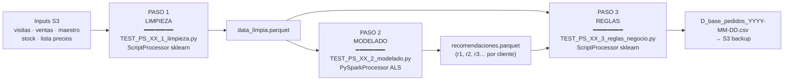

# Pipeline — los 3 pasos explicados

> Qué hace cada paso del pipeline, con inputs, outputs y la intuición detrás.

---

## Visión general

El pipeline de cada país es **idéntico en estructura**: 3 pasos encadenados que corren en SageMaker Processing Jobs. El paso 1 limpia, el paso 2 entrena el modelo, el paso 3 filtra con reglas de negocio.



---

## Paso 1 · Limpieza (`*_1_limpieza.py`)

**Tipo de job:** `ScriptProcessor` (imagen sklearn)
**Instancia:** `ml.m5.4xlarge` · 1 instancia
**Duración típica:** 5-10 min

### Qué hace

Toma los datos crudos de visitas y ventas y los deja en un formato limpio y unido para el modelo.

1. **Carga** `visitas_<pais>000.parquet` y `ventas_<pais>000.parquet` desde S3.
2. **Normaliza IDs**: construye `id_cliente = <PAIS>|<COMPANIA>|<CLIENTE>`.
3. **Extrae** `cod_articulo_magic` del campo `id_producto`.
4. **Filtra** por `fecha_proceso = hoy`.
5. **Deduplica** visitas (keep last por `ultima_visita`).
6. **Une** visitas con ventas históricas por `id_cliente`.
7. **Guarda** el parquet limpio en `/opt/ml/processing/output/limpieza/`.

### Entrada y salida

| | Ruta |
|---|---|
| **Input S3** | `s3://aje-prd-analytics-artifacts-s3/pedido_sugerido/data-v1/<pais>/...` |
| **Input mount** | `/opt/ml/processing/input/` |
| **Output mount** | `/opt/ml/processing/output/limpieza/` |
| **Output S3** | `s3://<pipeline-bucket>/<pipeline-name>/limpieza/` |

### Claves del código

- La clave compuesta `id_cliente` es **crítica**: sin ella, clientes con el mismo código numérico pero en compañías distintas se mezclarían.
- El filtro de `fecha_proceso` garantiza que solo se procesan las visitas **del día**.
- La deduplicación mantiene la visita más reciente cuando un mismo cliente aparece varias veces (caso común cuando un vendedor re-programa una visita).

---

## Paso 2 · Modelado (`*_2_modelado.py`)

**Tipo de job:** `PySparkProcessor` (Spark 3.3)
**Instancia:** `ml.m5.4xlarge` · 1 instancia
**Duración típica:** 10-20 min

### Qué hace

Entrena un modelo **ALS con preferencias implícitas** y genera las top-N recomendaciones por cliente.

1. **Lee** el parquet limpio del paso 1.
2. **Construye la matriz implícita**: `(id_cliente, cod_articulo_magic, rating)` donde `rating = count(distinct fecha_liquidacion)` en los últimos 12 meses. Es decir, *cuántas veces distintas compró ese SKU*.
3. **Mapea `id_cliente` → `clienteId_numeric`** con `StringIndexer` (ALS necesita IDs enteros).
4. **Entrena ALS**:
   ```python
   ALS(
       rank=10,
       maxIter=5,
       implicitPrefs=True,
       ratingCol="rating",
       itemCol="cod_articulo_magic",
       userCol="clienteId_numeric",
       coldStartStrategy="drop"
   )
   ```
5. **Genera recomendaciones**: `model.recommendForAllUsers(N)` produce una lista ordenada de SKUs por cliente.
6. **Des-pivota** la lista a columnas `r1, r2, r3, …` (ranking posicional).
7. **Guarda** el parquet de recomendaciones.

### Entrada y salida

| | Ruta |
|---|---|
| **Input mount** | `/opt/ml/processing/input/limpieza/` |
| **Output mount** | `/opt/ml/processing/output/modelado/` |
| **Forma del output** | `id_cliente`, `r1`, `r2`, …, `rN` (N ≈ 20) |

### ¿Por qué ALS implícito?

- **No tenemos ratings explícitos** — un cliente no califica productos, solo los compra (o no).
- **La frecuencia es una señal de confianza**: comprar algo 20 veces implica más afinidad que comprarlo 1 vez.
- **Spark ALS escala bien** a decenas de miles de clientes × miles de SKUs, que es el orden de magnitud de Perú.

**Más detalle del modelo:** [modelo-als.md](modelo-als.md).

---

## Paso 3 · Reglas de negocio (`*_3_reglas_negocio.py`)

**Tipo de job:** `ScriptProcessor` (imagen sklearn)
**Instancia:** `ml.m5.4xlarge` · 1 instancia
**Duración típica:** 3-5 min

### Qué hace

El modelo del Paso 2 solo sabe de afinidad estadística. El Paso 3 le añade **realidad comercial**: stock, precios, disponibilidad, historial reciente, etc.

Aplica los filtros en este **orden** (ver [reglas-negocio.md](reglas-negocio.md) para el detalle):

| Orden | Regla | Acción |
|---|---|---|
| 1 | **5.-9** Disponibilidad | Solo SKUs con venta en la ruta en los últimos 14 días. |
| 2 | **5.-8** Clasificación S/M/B | Marca tendencia y reordena. |
| 3 | **5.-7** Maestro | Excluye si no está en maestro vigente. |
| 4 | **5.-5** Stock | Excluye si stock < 3× venta diaria promedio. |
| 5 | **5.-4** Excel (opcional) | Excluye por lista manual. |
| 6 | **5.-3** Sin precio | Excluye SKUs hardcodeados sin precio. |
| 7 | **5.-2** Dedup histórica | Excluye SKUs ya recomendados en últimos 14 días. |
| 8 | **5.3** Ya comprados | **Despriorización** de SKUs comprados en últimas 2 semanas. |

También **calcula métricas auxiliares**:

- `tipoRecomendacion` — `PS1, PS2, …` según posición del SKU en el ranking final del cliente.
- `marca` — agregación por marca para reporting.
- `irregularidad` — score de varianza en frecuencia de compra (12 vs 6 meses) para identificar clientes con patrones inestables.
- `Cajas=1, Unidades=0` — valores default del pedido sugerido (negocio los completa).

### Entrada y salida

| | Ruta |
|---|---|
| **Input 1 mount** | `/opt/ml/processing/input/limpieza/` |
| **Input 2 mount** | `/opt/ml/processing/input/modelado/` |
| **Output mount** | `/opt/ml/processing/output/reglas/` |
| **Output S3** | `s3://aje-analytics-ps-backup/PS_<Pais>/Output/PS_piloto_v1/D_base_pedidos_YYYY-MM-DD.csv` |

### Formato de salida (CSV final)

```csv
Pais, Compania, Sucursal, Cliente, Modulo, Producto, Cajas, Unidades, Fecha, tipoRecomendacion, ultFecha, Destacar
PE,    10,       210,     12345,   PS,    508462,   1,     0,        2026-04-21, PS1, 2026-04-07, 1
PE,    10,       210,     12345,   PS,    524187,   1,     0,        2026-04-21, PS2, 2026-03-30, 0
...
```

---

## Cómo se encadenan los pasos en SageMaker

En el notebook orquestador (`TEST_PS_XX_4_orquestador_pipeline.ipynb`), cada step recibe los outputs del anterior como inputs:

```python
step_limpieza = ProcessingStep(
    name="Limpieza",
    processor=sklearn_processor,
    inputs=[...],
    outputs=[ProcessingOutput(
        output_name="limpieza",
        source="/opt/ml/processing/output/limpieza"
    )],
    code="TEST_PS_XX_1_limpieza.py",
    cache_config=cache_config,
)

step_modelado = ProcessingStep(
    name="Modelado",
    processor=pyspark_processor,
    inputs=[ProcessingInput(
        source=step_limpieza.properties.ProcessingOutputConfig.Outputs["limpieza"].S3Output.S3Uri,
        destination="/opt/ml/processing/input/limpieza"
    )],
    outputs=[ProcessingOutput(
        output_name="modelado",
        source="/opt/ml/processing/output/modelado"
    )],
    code="TEST_PS_XX_2_modelado.py",
    cache_config=cache_config,
)

step_reglas = ProcessingStep(
    name="Reglas",
    processor=sklearn_processor,
    inputs=[
        ProcessingInput(source=step_limpieza..., destination="/opt/ml/processing/input/limpieza"),
        ProcessingInput(source=step_modelado..., destination="/opt/ml/processing/input/modelado"),
    ],
    outputs=[ProcessingOutput(...)],
    code="TEST_PS_XX_3_reglas_negocio.py",
    cache_config=cache_config,
)

pipeline = Pipeline(
    name=f"pipeline-ps-{pais}",
    steps=[step_limpieza, step_modelado, step_reglas],
)
pipeline.upsert(role_arn=role).start().wait()
```

---

## Depuración rápida

| Síntoma | Dónde mirar |
|---|---|
| Paso 1 falla con "file not found" | El upstream no dejó el parquet de hoy. Revisa S3 + fecha de modificación. |
| Paso 2 falla con OOM | El ALS con muchos usuarios puede necesitar más memoria. Subir a `ml.m5.12xlarge` o bajar `rank`. |
| Paso 3 genera 0 filas | Revisar primero la regla 5.-9 (disponibilidad). Sin ventas recientes → 0 candidatos. |
| CSV final vacío para ciertas rutas | Posiblemente todas las SKUs cayeron por stock o dedup histórica. Es un comportamiento válido en rutas poco activas. |
| El notebook no ve cambios del script | Caché de Pipeline: renombra el step o deshabilita caché temporalmente. |

Logs: CloudWatch → `/aws/sagemaker/ProcessingJobs`.
