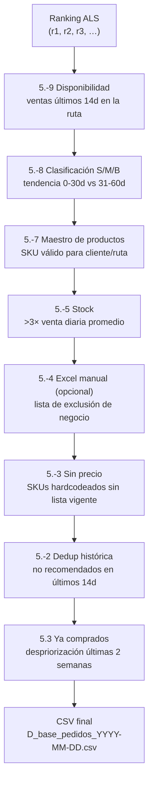

# Reglas de negocio (Paso 3)

> Por qué el modelo no decide solo. Las 9+ reglas que filtran y reordenan las recomendaciones antes de entregarse.

---

## Contexto

El modelo ALS (Paso 2) produce un **ranking de SKUs por cliente** basado puramente en afinidad estadística. Pero hay un montón de razones comerciales por las que un SKU con alto score **no debería** recomendarse:

- No hay stock.
- Se le acaba de recomendar ayer al mismo cliente.
- El cliente ya lo compró esta semana.
- No está en el maestro de productos vigente.
- No tiene precio asignado.
- No se ha vendido en la ruta en 2 semanas.

Las reglas están numeradas con una convención interna (`5.-9`, `5.-8`, …) que refleja el **orden histórico** de implementación.

---

## Orden de aplicación



---

## Detalle regla por regla

### Regla 5.-9 · Disponibilidad (14 días)

**Efecto:** elimina recomendaciones de SKUs que **no se han vendido en la ruta** durante los últimos 14 días.

**Por qué:** si nadie en la ruta compra ese SKU, probablemente no está disponible en el camión / no se está promoviendo / no está en rotación. Recomendarlo igual genera frustración.

**Implementación:** `join` entre recomendaciones y tabla de ventas por ruta de últimos 14 días. Se queda solo con lo que matchea.

---

### Regla 5.-8 · Clasificación S/M/B (tendencia)

**Efecto:** etiqueta cada SKU como:

| Tag | Significa | Criterio |
|---|---|---|
| **S** (Subida) | Ventas crecientes | ventas 0-30d > ventas 31-60d |
| **M** (Mantiene) | Flat | ventas 0-30d ≈ ventas 31-60d |
| **B** (Bajada) | Ventas cayendo | ventas 0-30d < ventas 31-60d |

Y **reordena** el ranking priorizando **S > M > B** dentro del top del cliente.

**Por qué:** un SKU "en subida" suele ser producto nuevo o en campaña → vale la pena empujarlo. Uno "en bajada" quizás está saliendo de catálogo.

---

### Regla 5.-7 · Maestro de productos

**Efecto:** filtra combinaciones `(cliente, SKU)` que no estén en el **maestro de productos vigente** del país.

**Por qué:** el maestro es la fuente de verdad de "qué productos están disponibles para qué clientes/compañías". Un SKU puede existir globalmente pero no estar aprobado para esa compañía o subsegmento.

**Fuente:** `maestro_productos_<pais>000` en S3 (descargado de Redshift `comercial_<pais>.dim_producto`).

---

### Regla 5.-5 · Stock

**Efecto:** excluye si `stock_actual < 3 × promedio_unidades_vendidas_diarias(12d)`.

**Por qué:** si con el stock actual no se cubren ni 3 días de demanda típica, **no tiene sentido** incentivar más pedidos — se agotará antes de atender lo ya comprometido.

**Implementación:**

```python
# Pseudo-código
promedio_dia = ventas_ultimos_12d.unidades.sum() / 12
if stock_actual < 3 * promedio_dia:
    excluir()
```

---

### Regla 5.-4 · Lista Excel (opcional)

**Efecto:** excluye SKUs listados en un Excel manual subido por negocio (ej. `LISTA DE PRECIOS MEXICO_YYYY-MM-DD.xlsx`, hoja `LISTA SKUS`).

**Por qué:** mecanismo de override manual. Si negocio decide "no recomendar estos 5 SKUs esta semana", los añade al Excel.

**Estado:** **comentada / opcional** en la mayoría de países. Activarla requiere tener el Excel al día en `Input/`.

---

### Regla 5.-3 · SKUs sin precio (hardcoded)

**Efecto:** excluye una lista fija de SKUs que **no tienen precio vigente** asignado.

**Por qué:** sin precio, el vendedor no puede cerrar la venta — recomendar es inútil.

**Ejemplo (extracto, Perú):**

```python
SKUS_SIN_PRECIO = [
    508505, 508506, 508507,
    # ... ~50 SKUs hardcodeados
]
```

Esta lista varía por país (ver [paises.md](paises.md)). Se actualiza manualmente cuando negocio reporta SKUs sin precio.

---

### Regla 5.-2 · Deduplicación histórica (14 días)

**Efecto:** excluye SKUs ya recomendados al mismo cliente en los **últimos 14 días**.

**Por qué:** para dar variedad. Si ayer le recomendamos `508462` y no lo compró, recomendárselo otra vez hoy tiene poco impacto.

**Implementación:** lee los CSVs `D_base_pedidos_YYYY-MM-DD.csv` de los últimos 14 días desde S3, construye un set por cliente, y excluye.

---

### Regla 5.3 · SKUs ya comprados (despriorización)

**Efecto:** **despriorización** (no eliminación) de SKUs que el cliente ya compró en las últimas 2 semanas.

> **Cambio reciente (commit `ffa28e9`)**: antes eran **eliminados** del ranking. Ahora se les **baja la prioridad**. Esto es importante porque un cliente puede legítimamente querer re-comprar el mismo SKU pocos días después (reposición frecuente) — eliminarlo del todo era muy agresivo.

**Lógica:**

```python
# Pseudo-código
if sku in compras_ultimas_2_semanas[cliente]:
    # no se elimina — se mueve al final del ranking
    score_ajustado = score_original * penalty_factor
```

---

## Métricas y columnas auxiliares que se calculan

Más allá del filtrado, el paso 3 **enriquece** el output final:

### `tipoRecomendacion`

Posición del SKU en el ranking final del cliente **después de los filtros**:

- `PS1` — primera recomendación (la más fuerte).
- `PS2` — segunda.
- …
- `PS20` — vigésima.

Si un cliente termina con menos de 20 SKUs válidos tras filtrar, se rellena hasta donde alcance.

Para Ecuador además se usan `PE1, PE2, …` (plan estratégico) y `PR1, PR2, …` (pedido recurrente) para distinguir el origen.

### `marca`

Se adjunta la marca comercial del SKU (desde el maestro) para facilitar agrupaciones en Reporting.

### `irregularidad`

Score que mide si las compras del cliente son **regulares** o **erráticas**:

```
irregularidad = varianza(frecuencia_mensual_últimos_12m) / varianza(frecuencia_mensual_últimos_6m)
```

Clientes con irregularidad alta son candidatos a revisión manual — sus patrones no se modelan bien con ALS.

### `Cajas`, `Unidades`

Valores **default** del pedido sugerido (`Cajas=1, Unidades=0`). El vendedor los ajusta en campo.

### `Destacar`

Flag binario `0/1` para marcar SKUs que negocio quiere resaltar visualmente en Salesforce (ej. los del ranking `PS1`).

---

## Formato final del CSV

```csv
Pais, Compania, Sucursal, Cliente,  Modulo, Producto, Cajas, Unidades, Fecha,       tipoRecomendacion, ultFecha,    Destacar
PE,   10,       210,      12345,    PS,     508462,   1,     0,        2026-04-21,  PS1,                2026-04-07,  1
PE,   10,       210,      12345,    PS,     524187,   1,     0,        2026-04-21,  PS2,                2026-03-30,  0
PE,   10,       210,      12345,    PS,     530001,   1,     0,        2026-04-21,  PS3,                2026-03-15,  0
...
```

---

## Resumen de impacto

En un día típico de Perú:

```
ALS genera:           ~4.000.000 candidatos (200k clientes × 20 SKUs)
Tras 5.-9:            ~2.500.000
Tras 5.-7:            ~2.300.000
Tras 5.-5 (stock):    ~1.800.000
Tras 5.-3 (precio):   ~1.700.000
Tras 5.-2 (dedup):    ~1.200.000
Tras 5.3 (comprados): ~1.200.000 (no elimina, solo reordena)

Top-20 por cliente → CSV final: ~3.500.000 filas (180k clientes × promedio 19 SKUs)
```

Las reglas **recortan aproximadamente 50-70%** de los candidatos del modelo antes de emitir el CSV.
