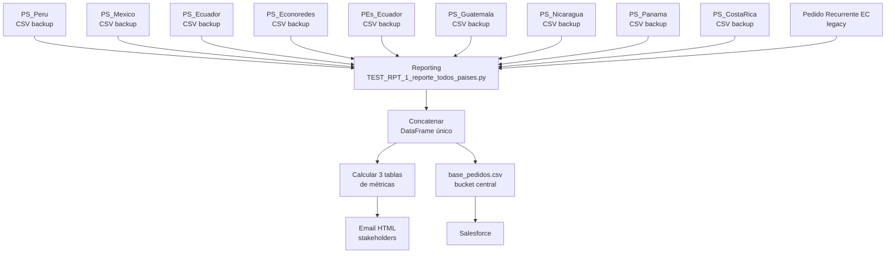

# Reporting — consolidación de los 8 países

> El último eslabón del pipeline: junta las salidas de todos los países, calcula métricas, envía email y sube el archivo central que consume Salesforce.

---

## Qué es

La carpeta `Reporting/` contiene un pipeline de **post-proceso** que se ejecuta **después** de que todos los países hayan terminado sus pipelines PS. Su función es unificar.



---

## Archivos

```
Reporting/
├── PROD_0_D_PS_All_paises.ipynb         ← Notebook todo-en-uno (referencia)
├── TEST_RPT_1_reporte_todos_paises.py   ← Script productivo (~259 líneas)
└── TEST_RPT_2_orquestador_pipeline.ipynb ← Lanza el job en SageMaker
```

---

## Flujo detallado de `TEST_RPT_1_reporte_todos_paises.py`

### 1. `cargar_todos_los_paises()`

Lee las salidas de cada país desde el bucket de backup:

```
s3://aje-analytics-ps-backup/
├── PS_Peru/Output/PS_piloto_v1/D_base_pedidos_YYYY-MM-DD.csv
├── PS_Mexico/Output/PS_piloto_v1/D_base_pedidos_YYYY-MM-DD.csv
├── PS_Ecuador/Output/.../D_base_pedidos_YYYY-MM-DD.csv
├── PS_Econoredes_Ecuador/Output/.../...
├── PEs_Ecuador/Output/.../...
├── PS_Guatemala/Output/.../...
├── PS_Nicaragua/Output/.../...
├── PS_Panama/Output/.../...
└── PS_CostaRica/Output/.../...
```

Los concatena en un solo DataFrame con **12 columnas estandarizadas**:

| Columna | Tipo | Descripción |
|---|---|---|
| `Pais` | str | Código país (PE, MX, EC, GT, NI, PA, CR) |
| `Compania` | int | Código de compañía |
| `Sucursal` | int | Sucursal / ruta |
| `Cliente` | int/str | ID cliente |
| `Modulo` | str | `PS` / `PE` / `PR` |
| `Producto` | int | `cod_articulo_magic` |
| `Cajas` | int | Default `1` |
| `Unidades` | int | Default `0` |
| `Fecha` | date | Fecha de proceso |
| `tipoRecomendacion` | str | `PS1, PS2, …, PE1, PR1, …` |
| `ultFecha` | date | Última fecha de compra del cliente-SKU |
| `Destacar` | int | Flag `0`/`1` para resaltar en Salesforce |

**Cambio reciente (commit `3e8e754`)**: antes cada país se subía por separado; ahora el Reporting carga todo en **un solo archivo** en memoria — más simple, más rápido.

---

### 2. `generar_metricas()`

Calcula **3 tablas** de resumen que van al email:

#### Tabla A — Resumen por país

| Pais | Clientes únicos | Recomendaciones totales | SKUs únicos | Recs/cliente (avg) |
|---|---|---|---|---|
| PE | 180.500 | 3.450.200 | 1.823 | 19.1 |
| MX | 12.400 | 245.600 | 412 | 19.8 |
| EC | 56.700 | 1.108.900 | 987 | 19.6 |
| GT | 34.200 | 670.100 | 654 | 19.6 |
| … | | | | |

#### Tabla B — Detalle por sucursal

Breakdown a nivel `(Pais, Compania, Sucursal)`. Útil para detectar rutas con cobertura baja (pocos clientes recomendados) o anómalas.

#### Tabla C — Tipo de recomendación

| Modulo | Nº filas |
|---|---|
| PS  | 5.280.000 |
| PE  | 12.400    |
| PR  | 8.200     |

Permite ver rápido cuántas recomendaciones vienen del ML (PS) vs las estratégicas (PE) vs las recurrentes legacy (PR).

---

### 3. `construir_html()`

Renderiza las 3 tablas como HTML con estilos inline (para que los clientes de email no rompan el formato). Inserta:

- Título con la fecha del proceso.
- Tabla A al tope (vista ejecutiva).
- Tabla B colapsable o al final (detalle).
- Tabla C al medio (mix de recomendaciones).

---

### 4. `enviar_correo()`

Usa `smtplib` + Gmail SMTP (`smtp.gmail.com:587`).

**Destinatarios hardcodeados** en el script — lista de stakeholders del negocio (gerentes comerciales por país, equipo de ciencia de datos, etc.).

**Credenciales:** también hardcodeadas (⚠️). En un refactor deberían moverse a Secrets Manager o a variables de entorno inyectadas por SageMaker.

El email lleva:
- Subject: `[AJE Pedido Sugerido] Reporte {fecha}`.
- Body: HTML con las 3 tablas.
- Sin adjuntos (el CSV final vive en S3).

---

### 5. `guardar_consolidado()`

**Dos destinos**:

**(a) Backup** — histórico completo:

```
s3://aje-analytics-ps-backup/Output/0_Final_PS/base_pedidos_final_YYYY-MM-DD.csv
```

Un archivo por día. Sirve para auditoría y para poder rehacer análisis retrospectivos.

**(b) Archivo central** — el que Salesforce consume:

```
s3://aje-prd-pedido-sugerido-orders-s3/PE/pedidos/base_pedidos.csv
```

**Sobrescribe cada día** (no es histórico). Es un "inbox" que la integración con Salesforce levanta.

---

## Orquestación

El notebook `TEST_RPT_2_orquestador_pipeline.ipynb` lanza `TEST_RPT_1_reporte_todos_paises.py` como un **ScriptProcessor** de SageMaker, análogo a los pipelines por país pero con un solo step.

```python
step_reporting = ProcessingStep(
    name="Reporting",
    processor=sklearn_processor,
    code="TEST_RPT_1_reporte_todos_paises.py",
    inputs=[],  # lee directamente de S3, no necesita mounts
    outputs=[],
)

pipeline = Pipeline(name="pipeline-reporting", steps=[step_reporting])
pipeline.upsert(role_arn=role).start().wait()
```

**Timing:** se ejecuta **después** de que los 8 pipelines de países terminen. Hoy esto se coordina manualmente (lanzar cuando estén listos) o vía EventBridge escuchando los `ExecutionStatusChanged` de cada pipeline.

---

## Debugging

| Síntoma | Posible causa |
|---|---|
| Falta un país en el email | El CSV de ese país no existe en S3 con la fecha del día. Revisar su pipeline. |
| Número de recomendaciones muy bajo | Casi seguro problema en el paso 3 de ese país (reglas muy estrictas o datos de entrada faltantes). |
| Email no llega | Credenciales Gmail bloqueadas o destinatario en spam. Probar con `python TEST_RPT_1_reporte_todos_paises.py --dry-run` (si está implementado) y revisar logs. |
| Archivo central `base_pedidos.csv` vacío | Concatenación falló — revisar `cargar_todos_los_paises()` en logs CloudWatch. |

---

## TODO / deuda técnica conocida

- **Credenciales en código**: mover a Secrets Manager.
- **Destinatarios hardcodeados**: mover a una tabla de configuración o archivo externo.
- **Coordinación entre pipelines**: no hay hoy un trigger automático. EventBridge + regla que espere los 8 `Succeeded` sería el siguiente paso.
- **El CSV central se sobrescribe sin locking**: si Reporting corre concurrentemente (ej. un reintento manual mientras está corriendo el automático), podría haber una carrera. En la práctica no ha pasado, pero conviene vigilar.
